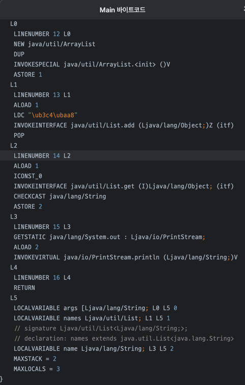

# item28.배열보다는 리스트를 사용하라
배열보다는 리스트를 사용하라고 권장하는 이유는 무엇일까?

## 불공과 불공변
```java
// 공변
Object[] anything = new String[10];
// anything[0] = 1; // ArrayStoreException
```
우선 공변을 보자,
공변이란? `Object[]`가 `String[]`의 하위 타입이라는 것이다.</br>
`Object[]`에 `String[]`을 넣을 수 있다는 것이다.</br>

주석처리 되어있는 anything[0] = 1;을 실행하면 코드상으로 문제가 없어보인다.</br>
Ojbecjt[]에 int를 넣는 것이기때문에</br>
하지만 anything배열은 String배열이기 때문에 런타임에 `ArrayStoreException`이 발생한다.

반면에 제네릭은 불공변이다.
```java
// 불공변
List<String> names = new ArrayList<>();
// List<Object> objects = names; // 컴파일 에러 
}
```
불공변이란? `List<Object>`가 `List<String>`의 하위 타입이 아니라는 것이다.</br>
`List<Object>`에 `List<String>`을 넣을 수 없다는 것이다.</br>
그렇기에 컴파일 에러가 발생한다.

## 배열은 실체화된다.
실체화라는게 무슨 뜻일까?
`Object[] anything = new String[10];` 이 코드를 보자.</br>
내가 작성한 타입이 런타임에도 유지가 되는 것이다.</br>
이러한 것을 보고 배열은 실체화가 된다 라고 이야기한다.

하지만 제네릭은 실체화되지 않는다.</br>
`List<String> names = new ArrayList<>();` 이 코드를 보자.</br>
String이라는 제네릭이 컴파일을 하고나면 정보가 사라진다.</br>
이러한 것을 보고 제네릭은 실체화되지 않는다 라고 이야기한다.(소거된다)</br>

소거 되도록 구현된 이유는 하위버전 호환성 때문이다.</br>

```java
List<String> names = new ArrayList<>();
names.add("도모");
String name = names.get(0);
System.out.println(name);
```
위 코드가 컴파일 되면 아래와 같이 바뀐다.
```java
List names = new ArrayList();
names.add("도모");
Object o = names.get(0);
String name = (String) o;
System.out.println(name);
```
컴파일러가 제네릭을 확인하여 캐스팅하는 코드를 넣어준다.</br>
이러한 정보는 바이트코드를 확인하면 볼 수 있다.


배열과 제네릭을 같이 사용하면 이상해진다.</br>
제네릭은 컴파일타임에서 깨지고, 배열은 런타임에 깨진다.</br>

그래서 결론적으로 제네릭을 추천한다고 한다. 그 이유는 컴파일에러가 더 낫기 때문이다.</br>

## 제네릭 배열을 만들지 못하게 막은 이유
제네릭 배열을 만들지 못하게 막은 이유는 무엇일까?</br>
책에서는 타입이 안전하지 않기 때문이라고 한다.</br>
만약 이를 허용한다면 컴파일러가 자동으로 제네릭을 확인하여 캐스팅하는 코드에서</br>
런타임에 ClassCastException이 발생할 수 있다.</br>
이는 런타임에 ClassCastException이 발생하는 일을 막아주겠다는 제네릭 타입 시스템의 취지에 어긋나는 것이다.

코드로 더 구체적으로 알아보자.
```java
// 제네릭 배열 생성을 허용한다면
List<String>[] stringLists = new List<String>[1];       (1)
List<Integer> intList = List.of(42);        (2)
Object[] objects = stringLists;     (3)
objects[0] = intList;       (4)
String s = stringLists[0].get(0); // ClassCastException     (5)
System.out.println(s);
```
위 코드에서 제네릭 배열 생성을 허용한다고 가정해보자.</br>
위 코드는 컴파일 단계에서 아무 문제가 없다.</br>
예시 3번에서 List배열을 Object배열에 넣었다.</br>
예시 4번줄에서 보면 Object배열에 intList를 넣었다. 이것도 문제가 되지 않는다.</br>
하지만 5번째 줄에서 문제가 발생한다.</br>
stringLists[0]에는 intList가 들어가있는데 이것을 String으로 캐스팅하려고 하니 ClassCastException이 발생한다.</br>

## 배열을 썼을때 문제점
```java
public class Chooser_Array {
    private final Object[] choiceArray;
	
    public Chooser_Array(Collection choices) {
        choiceArray = choices.toArray();
    }
	
    public Object choose() {
        Random rnd = ThreadLocalRandom.current();
        return choiceArray[rnd.nextInt(choiceArray.length)];
    }
	
    public static void main(String[] args) {
        List<Integer> intList = List.of(1, 2, 3, 4, 5, 6);
        
        Chooser_Array chooser = new Chooser_Array(intList);
		
        for (int i = 0; i < 10; i++) {
            Number choice = (Number) chooser.choose();
            System.out.println(choice);
        }
    }
}
```
위 코드의 클래스는 컬렉션을 생성자로 받아서 컬렉션 안에 들어있는 요소중에 랜덤한 값을 리턴해주는 기능을 하는 클래스이다.</br>
이 코드를 사용한다면 타입 캐스팅을 하는 부분에서 문제가 발생한다.</br>
만약 리스트에 들어가있는 값과 호환하지 않는 다른 타입으로 형변환을 하려고 한다면 문제가 생긴다.</br>
이러한 문제가 바로 배열 기반으로 코딩하였을 때 발생할 수 있는 문제 중 하나이다.

물론 choiceArray배열이 여러 타입을 지원해야하기 떄문에 Object[]로 사용했지만,</br>
Object[]가 아닌 항상 숫자만 사용한다고 하면 Integer배열을 생성하면 이러한 문제는 배열은 실체화가 되니까 런타임에도 해당하는 타입을 보존하여 해결된다.</br>
하지만 위 코드 같은 경우에는 어떠한 값이 들어올지 모르는 범용적인 경우에도 모두 동작하여야 한다.</br>
이러한 범용성이 있는 클래스를 만드는데 있어 타입 형변환에 문제를 해결하고자 나온게 제네릭이다.

## 제네릭을 사용한 Chooser
```java
public class Chooser<T> {
    private final T[] choiceArray;
    
    public Chooser(Collection<T> choices) {
        choiceArray = (T[]) choices.toArray();
    }
    
    public T choose() {
        Random rnd = ThreadLocalRandom.current();
        return choiceArray[rnd.nextInt(choiceArray.length)];
    }
    
    public static void main(String[] args) {
        List<Integer> intList = List.of(1, 2, 3, 4, 5, 6);
        
        Chooser<Integer> chooser = new Chooser<>(intList);
        
        for (int i = 0; i < 10; i++) {
            Integer choice = chooser.choose();
            System.out.println(choice);
        }
    }
}
```
위 코드는 제네릭을 사용하여 Chooser를 구현한 코드이다.</br>
위 코드에서 제네릭을 사용하지만 `choices.toArray();`가 Object[]를 리턴하기 때문에</br>
T[]로 형변환을 해주어야 한다.</br>
이러한 형변환은 타입안정성 때문에 컴파일러가 경고를 해준다.</br>
컴파일러를 제거하려면 `@SuppressWarnings("unchecked")`를 사용하면 된다.</br>

하지만 이것보다 더좋은 방법은 배열대신 리스트를 사용하면 된다.
```java
public class Chooser<T> {
    private final List<T> choiceList;
    
    public Chooser(Collection<T> choices) {
        choiceList = new ArrayList<>(choices);
    }
    
    public T choose() {
        Random rnd = ThreadLocalRandom.current();
        return choiceList.get(rnd.nextInt(choiceList.size()));
    }
    
    public static void main(String[] args) {
        List<Integer> intList = List.of(1, 2, 3, 4, 5, 6);
        
        Chooser<Integer> chooser = new Chooser<>(intList);
        // 로타입을 사용하지말라를 배웠으니 제네릭을 명시
        
        for (int i = 0; i < 10; i++) {
            Integer choice = chooser.choose();
            System.out.println(choice);
        }
    }
}
```
이렇게 되면 더이상 타입을 변환할 필요가 없어진다.

따라서 성능이 엄청 민감함 코드가 아니라면 배열보다는 리스트를 사용하자.

