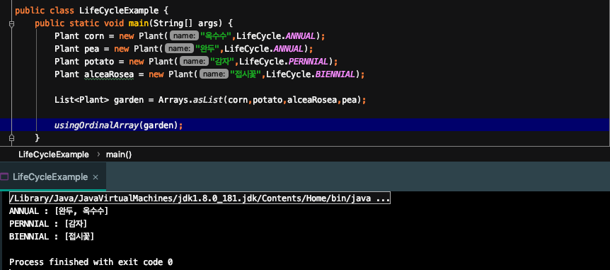
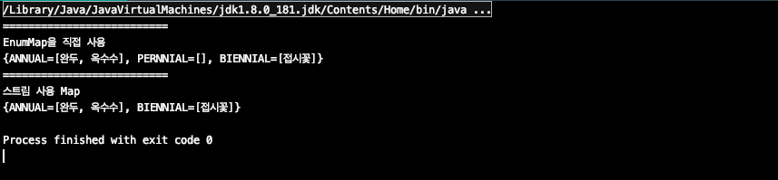
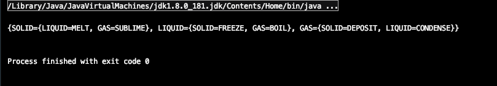
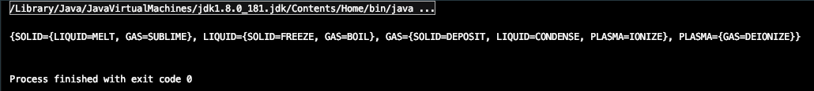

# item37. ordinal 인덱싱 대신 EnumMap을 사용하라

이따금 열거 타입의 ordinal을 배열의 인덱스로 이용하는 경우가 있다.</br>
식물의 생애주기를 열거 타입으로 표현한 LifeCycle 열거 타입을 예로 그러한 경우를 살펴보자.

```java
public class Plant {
    final String name;
    final LifeCycle lifeCycle;

    public Plant(String name, LifeCycle lifeCycle) {
        this.name = name;
        this.lifeCycle = lifeCycle;
    }

    @Override
    public String toString() {
        return name;
    }
}

public enum LifeCycle {
    ANNUAL, PERNNIAL, BIENNIAL
}
```
Plant 클래스는 LifeCycle 열거 타입을 멤버 변수로 가지고 있다. 이를 이용해서 식물들을 생애주기로 묶어보자. 

```java
public static void usingOrdinalArray(List<Plant> garden) {
    Set<Plant>[] plantsByLifeCycle = (Set<Plant>[]) new Set[LifeCycle.values().length];
    for (int i = 0 ; i < plantsByLifeCycle.length ; i++) {
        plantsByLifeCycle[i] = new HashSet<>();
    }

    for (Plant plant : garden) {
        plantsByLifeCycle[plant.lifeCycle.ordinal()].add(plant);
    }

    for (int i = 0 ; i < plantsByLifeCycle.length ; i++) {
        System.out.printf("%s : %s%n",
                LifeCycle.values()[i], plantsByLifeCycle[i]);
    }
}
```

위 코드는 맨 처음 언급한 열거 타입의 ordinal을 배열의 인덱스로 사용하는 코드이다.

1. Set 배열을 생성해 생애주기별로 관리한다. 총 3개의 배열이 만들어질 것이다. 각 배열을 순회하여 빈 HashSet으로 초기화 해준다.

2. plant 들을 배열의 Set에 추가한다. 이때 plant가 가지고있는 LifeCycle 열거타입의 ordinal 값으로 배열의 인덱스를 결정한다. 그 결과 식물의 생애주기 별로 Set에 추가된다.

3. 결과를 출력한다. 열거 타입의 values로 반환되는 열거 타입 상수 배열의 순서는 ordinal 값으로 결정되기 때문에 Set 배열의 각 Set이 의미하는 생애주기는 values의 순서와 같을것이다.



동작은 하지만 문제가 있다.

1. 배열은 제네릭과 호환되지 않는다. 따라서 비검사 형변환을 수행해야한다.

2. 사실상 배열은 각 인덱스가 의미하는 바를 알지못하기 때문에 출력 결과에 직접 레이블을 달아야 한다.

3. 정수는 열거 타입과 달리 타입 안전하지 않기 때문에 정확한 정숫값을 사용한다는 것을 직접 보증해야 한다.

이러한 단점들을 java.util 패키지의 EnumMap 을 사용하여 해결해보자.</br>
EnumMap은 열거 타입을 키로 사용하는 Map 구현체이다.</br>
다음은 EnumMap을 사용한 코드와 그 결과이다.

```java
public static void usingEnumMap(List<Plant> garden) {
    Map<LifeCycle, Set<Plant>> plantsByLifeCycle = new EnumMap<>(LifeCycle.class);

    for (LifeCycle lifeCycle : LifeCycle.values()) {
        plantsByLifeCycle.put(lifeCycle,new HashSet<>());
    }

    for (Plant plant : garden) {
        plantsByLifeCycle.get(plant.lifeCycle).add(plant);
    }

    //EnumMap은 toString을 재정의하였다.
    System.out.println(plantsByLifeCycle);
}
```


1. 이전 ordinal을 사용한 코드와 다르게 안전하지 않은 형변환을 사용하지 않는다.

2. 결과를 출력하기 위해 번거롭던 과정도 EnumMap 자체가 toString을 제공하기 때문에 번거롭지 않게되었다.

3. ordinal을 이용한 배열 인덱스를 사용하지 않으니 인덱스를 계산하는 과정에서 오류가 날 가능성이 존재하지 않는다.

4. EnumMap은 그 내부에서 배열을 사용하기 때문에 내부 구현 방식을 안으로 숨겨서 Map의 타입 안정성과 배열의 성능을 모두 얻어냈다.

여기서 EnumMap의 생성자는 한정적 타입 토큰의 키 타입의 Class 객체를 받는데 이는 제네릭의 타입 정보가 런타임시에 소거되기 때문에 런타임 제네릭 타입 정보를 제공하기 위해 키 타입의 Class 객체를 받도록 하였다.

이번엔 위의 코드를 Stream을 사용하여 간단하게 만들어보자.

```java
public static void streamV1(List<Plant> garden) {
    Map plantsByLifeCycle = garden.stream().collect(Collectors.groupingBy(plant -> plant.lifeCycle));
        System.out.println(plantsByLifeCycle);
    }

public static void streamV2(List<Plant> garden) {
    Map plantsByLifeCycle = garden.stream()
            .collect(Collectors.groupingBy(plant -> plant.lifeCycle,
                    () -> new EnumMap<>(LifeCycle.class),Collectors.toSet()));
    System.out.println(plantsByLifeCycle);
}
```

Collectors의 groupingBy 메소드를 이용하여 맵을 구성하였는데, streamV1 메소드 와 streamV2 메소드의 차이는 groupingBy 메소드에 원하는 맵 구현체를 명시하였는가의 차이다.
V1 메소드의 반환 맵은 HashMap을 사용하고 Key에 대응되는 Value는 ArrayList로 구성된다.
V2 메소드는 맵 구현체를 명시하였기 때문에 EnumMap을 사용하고 Value는 HashSet으로 구성된다.

앞서 보았던 EnumMap 버전과 Stream 버전은 동작이 살짝 다르다. EnumMap 버전은 열거 타입 상수 별로 하나씩 Key를 전부다 만들지만 Stream 버전에선 존재하는 열거 타입 상수만 Key를 만든다.

Plant 예제를 통해 확인해 보자.


이번엔 조금 더 복잡한 예제를 보자.

다음은 두 가지 상태(Phase)를 전이(Transition)와 맵핑하는 예제이다. LIQUID에서 SOLID의 전이는 FREEZE가 되고, LIQUID에서 GAS로의 전이는 BOIL이 될것이다.
```java
public enum Phase {
    SOLID, LIQUID, GAS;

    public enum Transition {
        MELT,FREEZE, BOIL, CONDENSE, SUBLIME, DEPOSIT;

        private static final Transition[][] TRANSITIONS = {
                {null, MELT, SUBLIME},
                {FREEZE, null, BOIL},
                {DEPOSIT, CONDENSE, null}
        };

        public static Transition from(Phase from, Phase to) {
            return TRANSITIONS[from.ordinal()][to.ordinal()];
        }
    }
}
```
앞서 보았듯 열거 타입 상수의 ordinal을 사용한 구조는 항상 문제가 따라왔다. 이번 예제에서도 Phase나 Transition의 상수의 선언 순서를 변경하거나 새로운 Phase 상수를 추가하는 경우에도 문제가 발생할 수 있다.

이 예제를 중첩 EnumMap을 이용하여 수정해보자. 
```java
public enum Phase {
    SOLID, LIQUID, GAS;

    public enum Transition {
        MELT(SOLID, LIQUID),
        FREEZE(LIQUID, SOLID),
        BOIL(LIQUID, GAS),
        CONDENSE(GAS, LIQUID),
        SUBLIME(SOLID, GAS),
        DEPOSIT(GAS, SOLID);

        private final Phase from;
        private final Phase to;

        Transition(Phase from, Phase to) {
            this.from = from;
            this.to = to;
        }

        private static final Map<Phase, Map<Phase, Transition>> transitionMap;

        static {
            transitionMap = Stream.of(values())
                    .collect(Collectors.groupingBy(t -> t.from, // 바깥 Map의 Key
                            () -> new EnumMap<>(Phase.class), // 바깥 Map의 구현체
                            Collectors.toMap(t -> t.to, // 바깥 Map의 Value(Map으로), 안쪽 Map의 Key
                                    t -> t, // 안쪽 Map의 Value
                                    (x,y) -> y, // 만약 Key값이 같은게 있으면 기존것을 사용할지 새로운 것을 사용할지
                                    () -> new EnumMap<>(Phase.class)))); // 안쪽 Map의 구현체
        }

        public static Transition from(Phase from, Phase to) {
            return transitionMap.get(from).get(to);
        }
    }
}
```

Transition 열거 타입은 각 전이에 맞는 이전 상태와 이후 상태를 필드로 가지고 있는 것으로 수정하였다.

기존에 2차원 배열을 사용하던것을 EnumMap 으로 사용하기 위해 java.util.stream 패키지의 Collectors의 메소드 중 groupingBy와 toMap을 사용하였다.
groupingBy는 하나의 Key에 여러개의 Value를 가지는 Map을 반환하고 toMap은 하나의 Key에 하나의 Value를 가지는 Map을 반환한다.

groupingBy에서 Key 값을 전이(Transition)를 이전 상태(from phase)을 기준으로 바깥쪽 Map을 묶고 toMap에서 이후 상태(to phase)를 기준으로 안쪽 Map을 묶는다.
toMap 메소드에서 (x,y) -> y 부분은 mergeFunction 으로 만약 Key 값이 같은게 존재할때 Value를 기존값(x)으로 할지 새로운값(y)으로 갱신할지 정하는 부분이다. 이번 예제에선 중복되는 Key값이 존재하지 않으므로 실제로는 사용되지 않는다.

전이 상태를 매핑한 TransitionMap을 출력해보자.



여기에 새로운 상태인 플라즈마(PLASMA)를 추가해보자. 플라즈마와 관련된 전이는 2개로 첫 번째는 기체에서 플라즈마로 변하는 이온화(IONIZE) 이고 두 번째는 반대인 탈이온화(DEIONIZE) 이다.

배열버전에선 이 상태들을 추가하는데 비용이 많이든다. 가령 원소 9개의 배열을 원소 16개의 배열로 교체해야하고, 만일 잘못된 순서로 나열하면 런타임 오류가 발생할 것이다.

EnumMap은 아주 간단하다. Phase에 PLASMA를 추가하고 TRANSITION에 두 전이 상태를 추가하면 끝이다.
```java
public enum Phase {
    SOLID, LIQUID, GAS, PLASMA;

    public enum Transition {
        MELT(SOLID, LIQUID),
        FREEZE(LIQUID, SOLID),
        BOIL(LIQUID, GAS),
        CONDENSE(GAS, LIQUID),
        SUBLIME(SOLID, GAS),
        DEPOSIT(GAS, SOLID),
        IONIZE(GAS, PLASMA),
        DEIONIZE(PLASMA, GAS);
    }
}
```


### 핵심정리
배열의 인덱스를 얻기 위해 ordinal을 쓰는 것은 일반적으로 좋지 않으니, 대신 EnumMap을 사용하라.</br>
다차원 관계는 EnumMap<..., EnumMap<...>> 으로 표현하라.</br>
"애플리케이션 프로그래머는 Enum.ordinal을 (웬만해서는) 사용하지 말아야 한다.(Item 35)"는 일반 원칙의 특수한 사례다.

