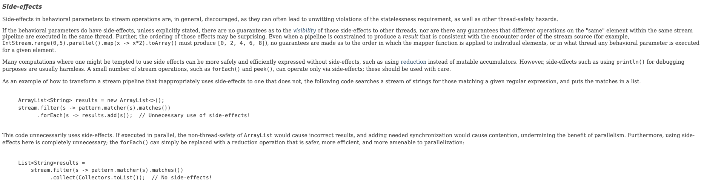

# 스트림에서는 부작용 없는 함수를 사용하라

### Stream 이란?
- 단순 API가 아닌, 함수형 프로그래밍에 기초한 패러다임 이다.
- 각 변환 단계는 가능한 한 이전 단계의 결과를 받아 처리하는 순수 함수여야 한다.
  - 순수함수란 오직 입력만이 결과에 영향을 주는 함수를 말한다.
  - 함수 객체는 모두 부작용(side effect)이 없어야 한다.

### Stream 패러다임을 이해하지 못한 채 API만 사용하면?
```java
// 텍스트파일을 읽어 각 단어별 빈도수를 세어 맵으로 반환한다.
Map<String, Long> freq = new HashMap<>();
try (Stream<String> words = new Scanner(file).tokens()) {
    words.forEach(word -> {
        freq.merge(word.toLowerCase(), 1L, Long::sum);
    });
}
```
- 위의 코드는 스트림을 가장한 반복적 코드이다.
- 이 코드의 모든 작업은 종단연산인 forEach에서 일어나는데, 이 때 외부 상태(빈도표)를 수정하는 람다를 실행한다.
- forEach는 그저 스트림이 수행한 연산 결과를 보여주는 일만 해야하는데, 그 이상을 하고 있다.
- forEach를 사용하는 것은 Stream을 사용하는 것이 아닌 단순 반복문 사용에 불과하며 또다른 Side Effect를 발생시킵니다.
[](https://docs.oracle.com/javase/8/docs/api/java/util/stream/package-summary.html#StreamOps)

### 스트림 패러다임을 잘 따르는 코드
```java
        // 텍스트파일을 읽어 각 단어별 빈도수를 세어 맵으로 반환한다.
                Map<String, Long> freq;
        try (Stream<String> words = new Scanner(file).tokens()) {
        freq = words
        .collect(groupingBy(String::toLowerCase, counting()));
        }
```
- 위의 코드는 스트림 패러다임을 잘 따르는 코드이다.
- 수집기(collector)를 사용하여 스트림의 원소들을 빈도표로 모은다.
- 자바의 for-each 반복문은 Stream의 forEach 종단 연산과 비슷하게 생겼다.
  - 하지만, Stream의 forEach 연산은 종단 연산 중 기능이 가장 적고 가장 '덜' 스트립답다.
- ***forEach 연산은 스트림 계산 결과를 보고할 때만 사용하고, 계산하는데는 쓰지 말자.***

### Side Effect 예시
### 예시 1
```java
public class StreamLaziness {

    private static IntStream createAStreamAndPerformSomeSideEffectWithPeek() {
        return IntStream.of(1, 2, 3)
                .peek(number -> System.out.printf("First. My number is %d\n", number))
                .map(number -> number + 1);
    }

    private static void consumeTheStream(IntStream stream) {
        stream.filter(number -> number % 2 == 0)
                .forEach(number -> System.out.printf("Third. My number is %d\n", number));
    }

    public static void main(String[] args) {
        IntStream stream = createAStreamAndPerformSomeSideEffectWithPeek();
        System.out.println("Second. I should be the second group of prints");
        consumeTheStream(stream);
    }

}
```

먼저 ```forEach , peek```를 이용해 상태를 변경하는 경우 발생할 **SideEffect**입니다.

일반적으로 위 코드를 작성하면 아래와 같은 순서로 console에 print 될 것으로 예상합니다.

```
First. My number is 1
First. My number is 2
First. My number is 3
Second. I should be the second group of prints
Third. My number is 2
Third. My number is 4
```

하지만 실제로는 아래와 같이 출력되죠.

```
Second. I should be the second group of prints
First. My number is 1
Third. My number is 2
First. My number is 2
First. My number is 3
Third. My number is 4
```

중간 연산이라는 ```peek```메서드의 특성상 종단 연산 ```forEach```가 실행되는 시점에 Lazy 하게 Stream 파이프라인이 실행되는 것이라고 볼 수 있는데요.

만약 중간에 **Stream** 원본을 변경하는 연산이 들어간다면? 실제로 원하는 결과와는 전혀 다른 결과가 발생할 수 있게 되는 것입니다.

### 예시 2
```java
static void func1(){
    List<Integer> matched = new ArrayList<>();
    List<Integer> elements = new ArrayList<>();
    for(int i=0 ; i< 100 ; i++) {
        elements.add(i);
    }
    elements.parallelStream()
            .forEach(e -> {
                if(e>=50) {
                    System.out.println(Thread.currentThread().getId() +  " " + matched);
                    matched.add(e);
                }
            });
    System.out.println(matched.size());

}
```

실행 결과는 아래와 같습니다.
```
13 []
18 [null]
18 [81, 78]
.
.
.
17 [81, 78, 79, 80, 75, 76, 77, 84, 85, 86, 50, 51, 52, 68, 96, 97, 92, 87, 65, 66, 67, 88, 89, 62]
17 [81, 78, 79, 80, 75, 76, 77, 84, 85, 86, 50, 51, 52, 68, 96, 97, 92, 87, 65, 66, 67, 88, 89, 62, 63]
15 [81, 78, 79, 80, 75, 76, 77, 84, 85, 86, 50, 51, 52, 68, 96, 97, 92, 87, 65, 66, 67, 88, 89, 값62, 63, 64, 71]
```

쓰레드에 따라 값이 제각각일 뿐 아니라 추가되는 순서도 다르고 동시성을 보장하지 못하는 자료구조```ArrayList```에 값을 추가하다 보니 종국에는 에러를 발생시킵니다.


이럴때 **Stream API**의 부작용 없는 메서드를 사용하면 코드의 가독성 뿐 아니라 위와 같은 **Side Effect**를 해결할 수 있습니다.

```java
static void func2(){
    List<Integer> elements = new ArrayList<>();
    for(int i=0 ; i< 100 ; i++) {
        elements.add(i);
    }
    List<Integer> matched = elements.parallelStream()
            .filter(e -> e >= 50)
            .collect(toList()); // 가독성을 높이기 위해 Collectors를 static import
    System.out.println(matched.size() + "  " + matched);
}
```
```
50  [50, 51, 52, 53, 54, 55, 56, 57, 58, 59, ... 98, 99]
```
바로 ```collect()``` 종단 연산인데요.
```collect()``` 종단 연산은 **Stream** 연산을 객체 하나로 수집한다는 의미의 ```Collectors``` 클래스를 활용할 수 있습니다.

아래 코드처럼 다양한 Collections를 만들 수 있습니다.

```java
// toList를 이용하여이름 List를 반환한다.
static List<String> collectToList(final List<User> users) {
    return users.stream()
            .map(User::getName)
            .collect(toList());
}

// toCollection을 이용하여 원하는 Collection을 반환한다.
static Set<User> collectToSet(final List<User> users) {
    return users.stream()
            .sorted(comparingInt(User::getAge))
            .collect(toCollection(TreeSet::new));
}

// 동명이인을 Map으로 grouping 할 수 있다.
static Map<String, Integer> groupingToMap(final List<User> users) {
    return users.stream()
            .collect(groupingBy(User::getName, summingInt(User::getAge)));
}

// downStream(나이 비교 최대값)을 이용하여 Map을 만들 수 있다.
static Map<String, User> collectorsToMap(final List<User> users) {
    return users.stream()
            .collect(toMap(User::getName, user -> user, BinaryOperator.maxBy(comparingInt(User::getAge))));
```

이외에도 **Collection**을 **Stream**으로 변경하여 문자열로 잇거나, 필터링하여 Map으로 전환하는 방법도 존재합니다.

```java
// 이름을 문자열로 이어붙인다.
static String joiningCollection(final List<User> users) {
    return users.stream()
            .map(User::getName)
            .collect(joining(", "));
}

// true / false로 파티셔닝 한다.
static Map<Boolean, List<User>> partitioningByFilter(final List<User> users) {
    return users.stream()
            .collect(partitioningBy(user -> user.getAge() > 25));
}
```
### 수집기(collector)
- 스트림의 원소들을 컬렉션에 모아주는 역할을 한다.
- 수집기가 생성하는 객체는 일반적으로 컬렉션이다. 그래서 collector라는 이름이 쓰인다.
- [java.util.stream.Collectors] 클래스에 정의되어 있고 39개의 메서드를 가지고있다
```java
// 빈도표에서 가장 흔한 단어 10개를 뽑아내는 스트림 파이프라인
List<String> topTen = freq.keySet().stream()
    .sorted(comparing(freq::get).reversed())
    .limit(10) 
    .collect(toList());  
}
```
- comparing: Comparator를 반환하는 정적 메서드
- freq::get: 입력받은 단어를 빈도표에서 찾아(추출) 빈도 반환
- reversed: Comparator를 반대로 변환하는 디폴트 메서드
- limit: 스트림의 일부를 반환하는 메서드

### 핵심 정리
- 스트림 파이프라인 프로그래밍의 핵심은 부작용 없는 함수 객체에 있다.
  - 스트림뿐 아니라 스트림 관련 객체에 건네지는 모든 함수 객체는 부작용이 없어야 한다.
- 종단 연산 중 forEach는 스트림이 수행한 계산 결과를 보고할 때만 사용하고, 계산에는 쓰지 말자.
- 스트림을 올바로 사용하려면 수집기(collector)를 잘 알아둬야 한다.
  - 수집기란 스트림의 원소들을 컬렉션에 모아주는 역할을 한다.
  - Collectors 클래스에는 다양한 수집기가 정의되어 있다.
  - toList, toSet, toMap, groupingBy, joining 등이 있다.
