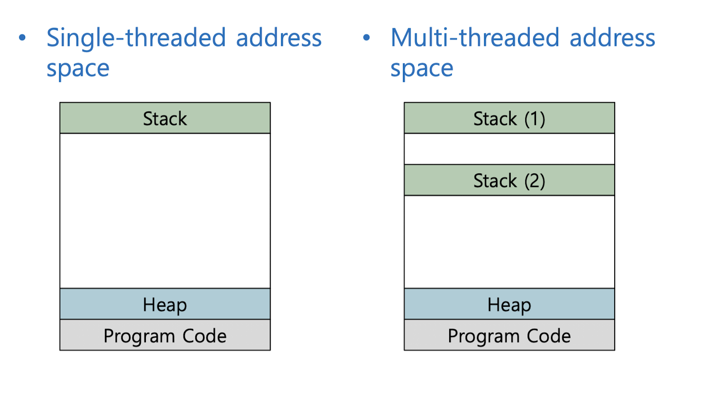

- 쓰레드는 힙 공간을 공유
- 여러 쓰레드에서 하나의 공유 자원에 대해서 동시에 접근했을때 문제가 발생 -> Race Condition
- 운영체제 관점에서는 Mutax나 Conditional Variable로 처리
- 자바 API에서는 synchronized 키워드를 활용해서 간단하게 동기화 처리가 가능

### 원자성
- Long, Double 은 원자성을 보장, 이외의 다른 타입은 원자성을 보장하지 못함 
- Point에 값을 넣어주는 것이 원자성을 보장할 수 있다고 생각하지만, 어셈블리 레벨에서는 그렇지 못함.
- 값을 변경하는 과정중 Context Switch가 발생할 수 있음

```java
class Point {
	int x;
	int y;
	
	public Point(int x, int y){ 
		this.x = x; 
		this.y = y; 
	}
	
}

var t= new Point(x, y);
```

### 안정적인 통신
- 동기화하지 않으면 메인 스레드가 수정한 값을 백그라운드 스레드가 언제쯤에나 보게 될지 보증할 수 없음

```java
public class StopThread {
	private static boolean stopRequested;

	public static void main(String[] args) throws InterruptedException {
		Thread backgroundThread = new Thread(() -> {
			int i = 0;
			while (!stopRequested) 
				i ++;
		});
		backgroundThread.start();

		TimeUnit.SECONDS.sleep(1);
		stopRequested = true;
	}
}
```


## synchronized
- 자바의 `synchronized` 키워드는 해당 메서드나 블록을 한번에 한 스레드씩 수행하도록 보장한다.

```java
public synchronized void increase() { }
```

1. 베타적 실행 보장
	- 스레드가 처리중일 경우 Lock을 걸어 상태 변경을 해줄 수 있도록 한다.
1. 안정적 통신
	- 한 스레드가 변화된 값을 읽을 수 있도록 해줌


## volatile
- 메인 메모리에 저장하겠다. 라고 명시
- 항상 가장 최근에 기록된 값을 읽게 됨을 보장 - 캐시 x
- 베타적 실행이 보장 되지 X, 잘못된 계산값을 반환할 수 있다.
- 안정적 통신만 보장

```java
public class StopThread {

    private static volatile boolean stopRequested;

    public static void main(String[] args) throws InterruptedException {

        Thread backgroundThread = new Thread(() -> {
            int i = 0;
            while(!stopRequested) {
                i++;
            }
        });

        backgroundThread.start();

        TimeUnit.SECONDS.sleep(1);
        stopRequested = true;
    }
}
```


### 결론
- AtomicLong등을 사용하면 락 없이 안전하게 사용이 가능
- 가변데이터 공유 금지, 불변데이터 위조로만
- 어쩔수 없이 공유할 경우에는 동기화를 사용할 것